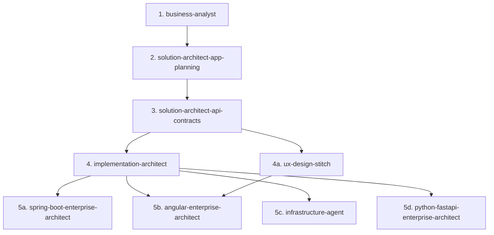

# Project Workflow

This project follows a strict, staged workflow. Each stage has a dedicated skill under `.codex/skills/`, and each stage's output is a required input for the next. Do not skip a stage or reorder them, and do not begin implementation before the earlier stages are complete.

The staged application workflow applies to product delivery. Maintenance of this skill library and its workflow documentation does not require fabricating application planning artifacts or a product `TASK-*`.

## Workflow Order

### 1. `business-analyst`

- Use first whenever a new product, platform, feature, or business idea is introduced.
- Elicits and grills the requirements, defines scope (MoSCoW), and produces the **Business Requirement Document (BRD)** at `docs/01-business-requirements.md`: executive summary, user personas, functional requirements matrix, user stories with Given-When-Then acceptance criteria, NFRs, and an open questions/risk register.
- Do not proceed to stage 2 until a BRD exists and is confirmed with the user.

### 2. `solution-architect-app-planning`

- Requires the **BRD** from stage 1 as mandatory input. If it's missing, ask for it (or re-run stage 1) before proceeding.
- Produces the **Application Development Planning Document** at `docs/02-application-development-plan.md`: feasibility/ADRs, system architecture and topology, database schemas, security/rate-limiting strategy, resiliency patterns, and integration architecture.
- Deliberately excludes API endpoints, DTOs, and event schemas - those belong to stage 3.
- Do not proceed to stage 3 until the Application Development Planning Document exists and is confirmed with the user.

### 3. `solution-architect-api-contracts`

- Requires **both** the BRD (stage 1) and the Application Development Planning Document (stage 2) as mandatory input.
- Consumes the already-decided architecture (does not re-litigate tech stack, topology, or database design) and produces the **API Contract & Integration Specification Document** at `docs/03-api-contract-integration-specification.md`, with machine-readable OpenAPI, AsyncAPI, and JSON Schema artifacts under `contracts/`: REST endpoint specs, DTOs/response envelopes, Kafka event schemas, per-endpoint security/rate-limit rules, and external integration contracts (Razorpay, FCM/APNs, MailHog/SMSHog).
- Do not begin implementation planning or implementation itself until this document exists and is confirmed with the user.

### 4. `implementation-architect`

- Requires **all three** prior artifacts as mandatory input: the BRD (stage 1), the Application Development Planning Document (stage 2), and the API Contract & Integration Specification Document (stage 3).
- Translates those documents into a structured **implementation strategy** at `docs/04-implementation-strategy.md`: a 5-tier Work Breakdown Structure (Phase/Milestone -> Backlog Item -> Task -> Activity -> Subtask), a traceability matrix (BRD FR IDs -> architecture services/modules -> API/event specs -> BLI/Task IDs), delivery phases/milestones, and a Definition of Done checklist.
- Do not proceed to implementation until this implementation strategy exists and is confirmed with the user.

### 4a. `ux-design-stitch`

- Requires the approved BRD, Application Development Plan, API Contract & Integration Specification, and relevant OpenAPI, AsyncAPI, and JSON Schema artifacts as read-only inputs.
- Uses the Google Stitch MCP to create one UX design scope at a time and produces the canonical `docs/DESIGN.md` handoff.
- Must not modify the BRD, Application Development Plan, API specification, or anything under `contracts/`. If the Stitch MCP is unavailable or a source conflict exists, stop at a non-mutating assessment.
- Angular implementation must not begin for a UI scope until `docs/DESIGN.md` exists with status `Ready for Angular` and covers that scope.

### 5. Implementation

Once the BRD, Application Development Planning Document, API Contract & Integration Specification Document, and implementation strategy are all finalized, move to implementation:

- **`spring-boot-enterprise-architect`** - for all backend (Spring Boot) implementation, scaffolding, and review work. Follow the API contracts produced in stage 3 and the tasks/subtasks produced in stage 4 exactly; do not invent endpoints or DTO shapes that weren't specified.
- **`python-fastapi-enterprise-architect`** - for Python FastAPI backend implementation, scaffolding, and review when the approved application plan selects it. Follow one stage-4 task and stage-3 contracts, reuse the approved Python package/dependency tooling, and enforce typed boundaries, resource/transaction ownership, authorization, migrations, and relevant tests. This is an alternative backend path, not authorization to replace Spring Boot or introduce a mixed stack.
- **`angular-enterprise-architect`** - for all frontend (Angular) implementation, scaffolding, and review work. Consume the API contracts produced in stage 3, the tasks/subtasks produced in stage 4, and the approved `docs/DESIGN.md` UX handoff as the source of truth for HTTP calls, request/response models, DTOs, screens, states, and interactions.
- **`infrastructure-agent`** - for deployment infrastructure: Docker Compose/production topology, service dependencies, configuration, observability, and backup/recovery. Treats the documents from stages 1-3 and the implementation strategy from stage 4 as the authority; do not use it for domain-service or Angular implementation, and it must not invent services, routes, topics, or integrations beyond what those artifacts specify. If it finds the stage-4 gate open or a required artifact missing/unapproved, it stops at a non-mutating assessment/plan rather than implementing infrastructure.

## Rules

- Store project planning, requirements, architecture, API specification, implementation strategy, UX handoff, decision, and project-report documents under `docs/` using an appropriate scoped subdirectory when needed. Do not create project documents at the repository root. Keep machine-readable API/event/schema contracts under `contracts/`, and keep source-adjacent technical metadata only where its owning tool or framework requires it.
- Follow the directory and module topology approved by `docs/02-application-development-plan.md` and decomposed by `docs/04-implementation-strategy.md`; do not create ad hoc source roots, duplicate applications, or alternate folder conventions during implementation.
- For FastAPI, follow the approved Python package topology, `pyproject.toml`, and dependency lock/reproducibility workflow. Keep HTTP/Pydantic boundaries separate from persistence, scope sessions per unit of work, and use the selected migration tool; Maven and Java package rules apply only to Spring Boot.
- Use Maven exclusively for Spring Boot builds. Do not create or recommend Gradle build files, Gradle wrappers, or Gradle commands; if an approved upstream artifact requires Gradle, report the conflict and route it back to the appropriate architecture stage. For an approved Spring Boot microservice architecture, use one root Maven aggregator/parent `pom.xml` with `packaging` set to `pom` to declare the module hierarchy and centrally manage Java, Spring Boot/Spring Cloud, dependency, and plugin versions. Keep the Maven Wrapper at the backend root. Put each deployable microservice in an isolated leaf module (optionally beneath domain/service aggregators); keep business code out of the root and never depend on another service's implementation module.
- Apply the Spring Boot package structure to monoliths as well as microservices. Give a single-module monolith a lowercase reverse-DNS product base package; give each microservice a distinct bounded-context/service suffix. Under each monolith application or microservice base, separate `config`, `security`, `resources`, `controller`, `service`, `facade`, `repo`, `entities`, `dtos.request`, `dtos.response`, mapping, exception, validation, event, and client responsibilities when they exist. For a modular monolith, keep each bounded context in its own capability package/module and repeat the applicable responsibility split inside it; do not flatten unrelated capabilities into global layer packages or create empty placeholder packages.
- Create every new Angular component/page with separate `.component.ts`, `.component.html`, `.component.scss`, and `.component.spec.ts` files. Keep tests colocated for other executable Angular units, and do not use inline component templates/styles or omit tests merely to reduce file count.
- Never jump straight to implementation without a BRD, Application Development Planning Document, API Contract & Integration Specification Document, and implementation strategy (BLIs/Tasks/Activities/Subtasks) in hand.
- Never fabricate business rules, architecture decisions, API contracts, or backlog items that weren't established in the preceding stage - go back and ask, or re-run the earlier skill.
- If a gap is discovered during implementation (e.g. a missing endpoint, an unclear business rule, or a task with no traceable requirement), resolve it by returning to the appropriate earlier stage rather than deciding it ad hoc in code.
- Execute exactly one `TASK-*` from `docs/04-implementation-strategy.md` per agent run. Dependencies may be read for context, but sibling tasks require separate runs and separate status updates.
- The `ux-design-stitch` design stage is the explicit exception to the `TASK-*` implementation rule: it handles exactly one UX design scope per run and writes the canonical `docs/DESIGN.md` handoff, plus only explicitly requested design previews/references in a scoped design-artifact directory.
- When subagent delegation is available and authorized, prefer one isolated subagent per task. Do not run agents concurrently against the same files, stateful resources, or task-status row. The coordinating parent owns the status transition after reviewing the subagent's evidence.
- Downstream planning, UX, implementation, and verification agents must treat `docs/01-business-requirements.md`, `docs/02-application-development-plan.md`, `docs/03-api-contract-integration-specification.md`, and every file under `contracts/` as read-only reference artifacts. Agents may read them but must not create, edit, delete, rename, reformat, or regenerate them. Discrepancies must be reported and routed back to the appropriate workflow stage. The owning stage (1 for BRD, 2 for the application plan, 3 for the API specification/contracts) may create or revise its own deliverables when that stage is requested; it must preserve upstream inputs and obtain user confirmation before downstream use.
- Before creating code, configuration, scripts, or deployment assets, search for and reuse existing approved implementations and shared utilities. Follow SOLID principles, clean-code practices, focused responsibilities, explicit interfaces, idempotency, and task-scoped refactoring; do not duplicate behavior or add speculative abstractions.
