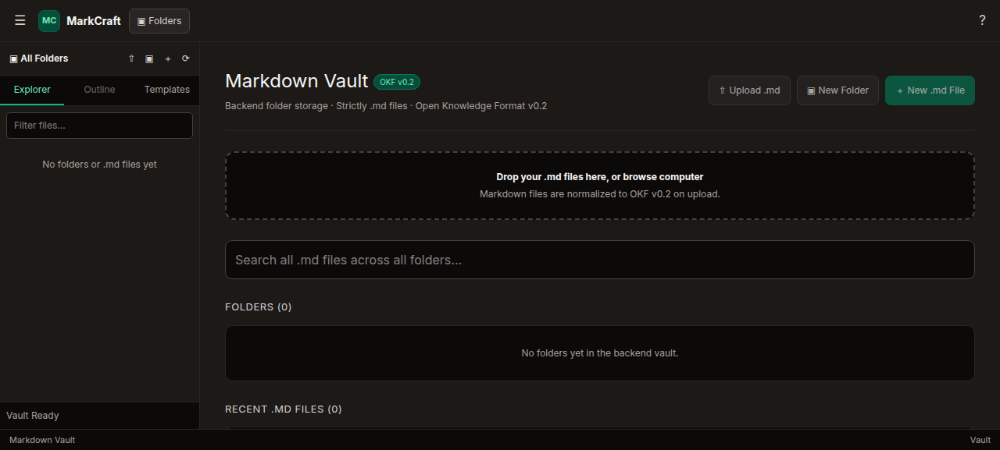
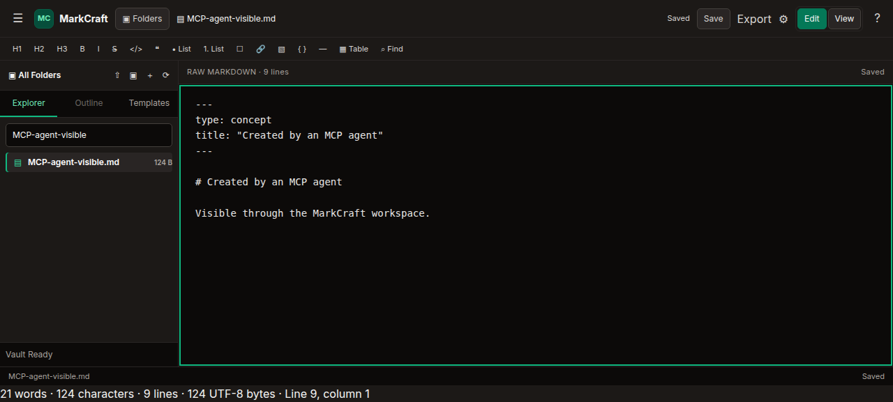
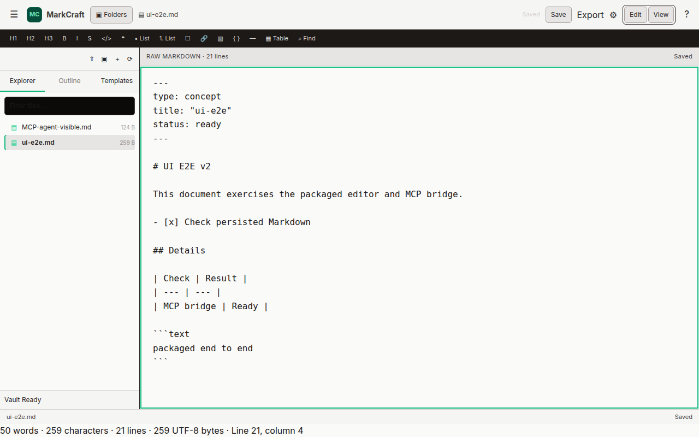
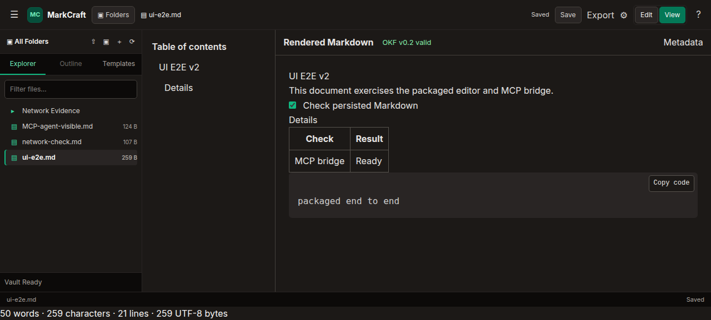
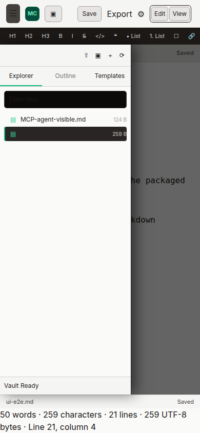

# MarkCraft E2E Test & Verification Report

| Metadata | Details |
| :--- | :--- |
| **Document Version** | `v2.0.0` |
| **Date** | 2026-09-24 |
| **Application Under Test** | MarkCraft `markcraft-0.1.0-SNAPSHOT.jar` |
| **Architecture** | Packaged Spring Boot 4.1.1 application serving Angular 21 on loopback |
| **Runtime** | Java 21.0.12.1; Angular build under Node 22.14.0 |
| **Browser** | `agent-browser` 0.38.1, headless Chromium |
| **Vaults** | Fresh temporary external vaults; one MCP-enabled, one default-disabled/empty |
| **Test Result** | **PASS — 15 fresh scenario groups; no browser console or page errors** |

## Summary

This v2 run exercised the current packaged application through browser flows and a real MCP Java SDK Streamable HTTP client. The browser and MCP client shared the same packaged instance and temporary vault for the agent-to-UI persistence handoff. A second fresh packaged instance verified the default empty-vault experience and MCP-off behavior.

The MCP client discovered all seven catalog tools and completed create/read/update, current and stale revision handling, upload create/replacement, move, file deletion, and recursive folder deletion. Boundary checks returned `401` for missing/invalid credentials and `400` for hostile Host/Origin values. The separately packaged acceptance script also confirmed deletion returns `DELETE_DISABLED` without changing data when disabled, and succeeds when enabled.

The browser exercised the workspace and confirmed its visible changes against the vault and API. Same-origin root/assets and tree/document reads returned `200`; folder creation returned `201`; document create returned `201`; conditional document update returned `200`. The clean launch returned an empty tree, with MCP GET and POST both returning `404` by default. Browser console and page-error checks returned no entries.

## Scenario results

| ID | Scenario | Observable result | Result |
| :--- | :--- | :--- | :--- |
| TC-E2E-V2-001 | Clean packaged launch | Fresh external vault rendered the empty workspace; `GET /api/v1/vault/tree` returned `200` with `data: []`; MCP GET/POST returned `404`. Root, hashed scripts/styles, and tree request returned `200`. | Pass |
| TC-E2E-V2-002 | MCP discovery, operations, and security | SDK initialized and discovered all seven tools. It created/read/replaced a document, confirmed stale-revision failure, created/replaced uploads, moved a file, deleted a file and a folder recursively. Missing/invalid token returned `401`; hostile Host/Origin returned `400`. | Pass |
| TC-E2E-V2-003 | MCP-to-browser handoff | With the browser closed, MCP wrote `MCP-agent-visible.md`; the browser then filtered for it, opened it, and displayed the saved heading and text. The same content was confirmed on disk and through REST. | Pass |
| TC-E2E-V2-004 | Folder and document creation | UI created `E2E Project` (`POST` `201`, tree refresh `200`) and `ui-e2e.md` (`PUT` `201`). | Pass |
| TC-E2E-V2-005 | Editing and persistence | UI edits autosaved; reload and reopen retained content. Manual Save produced `PUT` `200`; disk and subsequent REST read contained the saved Markdown. | Pass |
| TC-E2E-V2-006 | Find/replace and table generator | Replace All changed `MCP handoff` to `MCP bridge`; the 2×2 table dialog inserted valid Markdown into the open document. | Pass |
| TC-E2E-V2-007 | Rendered Markdown and task persistence | View mode rendered headings, table, code, and task checkbox; clicking the task saved `- [x]` and it remained checked after switching modes. Table of contents exposed both document headings. | Pass |
| TC-E2E-V2-008 | OKF metadata | Metadata dialog applied `status: ready`; the editor and persisted document showed the normalized frontmatter. | Pass |
| TC-E2E-V2-009 | Template and nested destination | Technical Guide template created under `E2E Project`; the tree/dashboard showed the nested path. The test folder was later removed by the recursive-delete scenario. | Pass |
| TC-E2E-V2-010 | Markdown upload | Browser selected a temporary Markdown fixture; upload results reported `browser-upload.md: created`, and the file appeared in the tree. | Pass |
| TC-E2E-V2-011 | Rename and confirmed file deletion | Uploaded file was renamed to `browser-upload-renamed.md`; permanent deletion required the confirmation dialog and the file disappeared from the tree and disk. | Pass |
| TC-E2E-V2-012 | Confirmed recursive folder deletion | The UI deleted `E2E Project`; its nested template document and folder were absent from the tree and filesystem. | Pass |
| TC-E2E-V2-013 | Export and print actions | Markdown download matched the source; HTML download contained rendered heading markup and excluded raw frontmatter. Copy showed “Rendered HTML copied.”; print showed “Print dialog opened.” | Pass* |
| TC-E2E-V2-014 | Preferences | Changed theme to Light and editor size to 16px, reloaded the packaged app, and confirmed both selections persisted. | Pass |
| TC-E2E-V2-015 | Mobile drawer | At 390×844, drawer opened/closed, focus returned to its toggle, and document scroll width remained 390px. | Pass |

\* The browser automation host denied direct clipboard readback (`NotAllowedError`). The app’s copy-success message was observed, and the separate HTML download was inspected; clipboard bytes were not independently read.

## Evidence

- **Empty packaged launch**:

  

- **MCP-created file opened in the browser**:

  

- **Saved application editor state**:

  

- **Rendered Markdown and table of contents**:

  

- **390px mobile drawer**:

  

## Automated gates and cleanup

- `PATH=.../node/v22.14.0/bin:$PATH ./scripts/verify-packaged-mcp.sh` — passed against packaged instances in both deletion modes; seven-tool SDK discovery and all-tool operations passed.
- `PATH=.../node/v22.14.0/bin:$PATH npm test` — 23 files and 74 tests passed.
- `./mvnw test -q` — 56 tests across 17 suites; 0 failures, 0 errors, 0 skipped.
- The packaged frontend build succeeded. It reports existing PrismJS CommonJS optimization warnings.
- `git diff --check` — passed.

Both browser sessions and packaged servers were closed. Temporary vaults, credentials, browser-upload fixtures, and exported downloads were removed after verification. Only this v2 report and its screenshots remain as E2E evidence; application and contract sources were not changed during this run.
