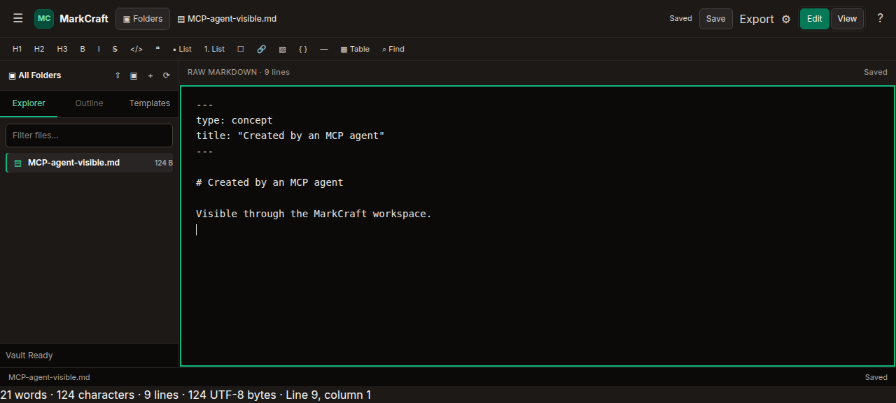

# TASK-MCP-004 — MCP client setup and packaged acceptance

Date: 2026-09-24

## Packaged client acceptance

Ran `./scripts/verify-packaged-mcp.sh` from the repository root. It rebuilt the Angular production assets, packaged the Spring Boot jar, launched it with temporary external vaults, and used the MCP Java SDK Streamable HTTP client to initialize and discover all seven tools.

Both deletion settings passed the transport boundary checks: missing and invalid bearer tokens returned `401`, and hostile `Host` and `Origin` headers returned `400`. With deletion disabled, `delete_item` returned `DELETE_DISABLED` and left the file intact. With deletion enabled, the client created and read a document, replaced it at the current revision, confirmed stale-revision rejection, created and replaced an upload, moved a document, deleted a file, and recursively deleted a folder. It left `MCP-agent-visible.md` in the enabled-mode vault for the browser check. The packaged UI and vault API were served from the same loopback origin.

## Browser persistence check

Started a packaged instance with a temporary vault, completed the enabled-mode MCP acceptance client, and then used `agent-browser` with the UI. The UI listed `MCP-agent-visible.md` in the vault tree; opening it showed the saved heading and text `Visible through the MarkCraft workspace.` Browser console and page-error checks returned no entries. The browser and temporary server were closed after capture.

## Final automated gates

- `./mvnw test -q` — 56 tests across 17 suites; 0 failures, 0 errors, 0 skipped.
- `./scripts/verify-packaged-mcp.sh` — passed, including the frontend production build and packaged all-tool run described above.
- `git diff --check` — passed.

The local client guide documents the VS Code Chat HTTP server configuration and password input using the official [VS Code MCP configuration reference](https://code.visualstudio.com/docs/agents/reference/mcp-configuration). It also records token handling, enablement, revision-aware writes, batch outcomes, and the separate deletion switch.
